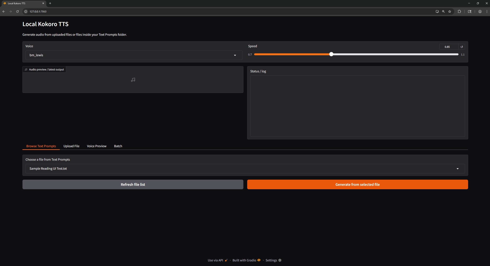

# Local Kokoro TTS Web UI

A local text-to-speech tool using Kokoro with a simple web interface.

> ⚠️ **Python Version Requirement**
>
> This project requires **Python 3.12**.
> 
> Python 3.13 is **not currently supported** and will cause installation errors.
>
> Verify your version with `py -0`
>
> If you do not have 3.12 install from the official Python website or run `winget install -e --id Python.Python.3.12`


## Preview



## Demo

https://github.com/user-attachments/assets/c17bf75f-4ffe-4e35-a5b1-59877f452851

## Features

- 50+ voice options
- Adjustable speech speed
- Voice preview with caching (fast after first load)
- Batch processing support
- Upload or browse text files
- Automatic model download on first run

## Accessing the UI

Run the app locally and open:

`http://127.0.0.1:7860`

Use the interface to select a voice, adjust speed, and generate speech from text files or uploads.

## Setup

1. Open Command Prompt

2. Create a folder where you want the project saved, for example:

```
cd "%USERPROFILE%\OneDrive\Desktop"
```

```
mkdir local-tts-web-ui
```

3. Clone the repository: 

```
git clone https://github.com/carsonmcrae/local-tts-web-ui.git
```

4. Navigate into the project folder:

```
cd local-tts-web-ui
```

5. Create and activate virtual environment:

```
py -3.12 -m venv venv
```

```
venv\Scripts\activate
```

```
python --version
```
> *(Note: You should be on Version 3.12.x)*


5. Install dependencies:

```
pip install -r requirements.txt
```
> *(Note: This installs required Python packages such as `gradio` and `kokoro-tts`, along with their dependencies. On first run, the app will automatically download the Kokoro model files (~350MB), including `kokoro-v1.0.onnx` and `voices-v1.0.bin`.)*

## Run

```
python kokoro_tts_ui.py
```

On first run, required model files (~350MB) will be downloaded automatically.

## Usage

- Place `.txt` files in the **Text Prompts** folder to use the Browse feature
- Or upload a file directly in the UI
- Generated audio files are saved in the **outputs** folder

## Controls

### Start the app

```
cd C:\Users\YourName\Desktop
```

```
venv\Scripts\activate
```

```
python kokoro_tts_ui.py
```

### Stop the app

- Press: `Ctrl + C`
- If prompted: type `Y`

## Notes

- Voice previews are cached after first generation for faster playback
- Model files are not included in the repo and will download automatically

## About This Project

This project is a local text-to-speech (TTS) web application built on top of the Kokoro TTS engine. It allows users to convert written text into spoken audio using a variety of synthetic voices, all running entirely on their own machine.

The primary goal of this project is to provide a simple, user-friendly interface for high-quality text-to-speech generation without requiring any external APIs or paid services. Everything runs locally, which means no internet dependency after setup and no data leaving your machine.

## How It Works

At a high level, the application combines three main components:

1. **Frontend Interface (Gradio)**  
   A lightweight web UI that runs locally in your browser. It allows users to:
   - select voices  
   - adjust speech speed  
   - upload or browse text files  
   - preview and generate audio  

2. **TTS Engine (Kokoro)**  
   The core text-to-speech system that converts text into audio. This is installed as a Python package and handles the actual synthesis logic.

3. **Local Model Files**  
   On first run, the app automatically downloads required model files:
   - `kokoro-v1.0.onnx` (speech model)  
   - `voices-v1.0.bin` (voice data)  

   These files are used by the TTS engine to generate realistic speech and are stored locally.

## Why This Exists

Most modern text-to-speech tools rely on cloud-based APIs, which can:
- require subscriptions or usage fees  
- introduce latency  
- raise privacy concerns  

This project was built to explore a fully local alternative that:
- is free to use  
- works offline after setup  
- gives users full control over their data  

## Intended Use Cases

- Converting written content into audio for review  
- Testing and comparing different synthetic voices  
- Generating narration for small projects  
- Experimenting with local AI tools  

---

This project is designed to be simple, fast, and accessible while still exposing the core capabilities of a modern TTS system.